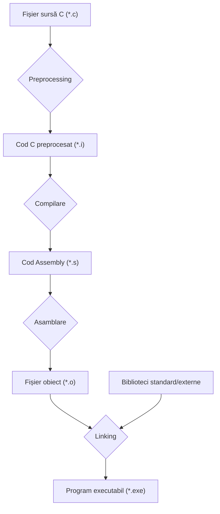

### Introducere. Structura unui program C. Variabile.


---
layout: cover
color: stone-light
---

# Ce înseamnă a programa?


---
layout: top-title
align: c
color: stone-light
---
:: title ::

# Ce înseamnă a programa?

:: content ::

<div className="neversink-stone-light-scheme bg-[var(--neversink-admon-bg-color)] p-6 rounded-lg border border-[var(--neversink-admon-border-color)] text-[var(--neversink-text-color)]">

Programarea este procesul de a-i da unui computer un set de **instrucțiuni precise** pentru a rezolva o problemă sau a executa o sarcină.
</div>

<br/>

  <div class="neversink-stone-light-scheme bg-[var(--neversink-admon-bg-color)] p-6 rounded-lg border border-[var(--neversink-admon-border-color)]">
    <h3 class="text-xl font-bold text-[var(--neversink-text-color)]"> Instrucțiuni Specifice</h3>
    <p>Imaginați-vă că trebuie să-i explicați unui robot cum să facă un sandviș.</p>
    <div class="mt-4 text-left">
    <div class="ns-c-tight">

- NU: "Fă un sandviș!"
- DA: "Ia o felie de pâine. Ia un cuțit. Deschide borcanul..."

</div>
</div>
  </div>

---
layout: cover
color: stone-light
---

### Ce e un limbaj de programare?
##### Ce limbaj vom invata noi?

---
layout: top-title
align: c
color: stone-light
---
:: title ::

# Limbaj, Cod Sursă și Compilator

:: content ::

<div class="ns-c-tight">

- **Limbajul de programare**: O limbă specială, cu reguli stricte (sintaxă), pe care o folosim pentru a scrie instrucțiuni pe care computerul le poate înțelege. Noi vom învăța **limbajul C**.

- **Codul Sursă**: Textul pe care îl scriem într-un limbaj de programare. Este "rețeta" noastră. De obicei, îl salvăm în fișiere cu extensia **`.c`**.

- **Compilatorul**: Un program special care traduce "rețeta" noastră (codul sursă) din limbajul C într-un limbaj pe care procesorul computerului îl înțelege direct (cod mașină). Rezultatul este un fișier **executabil**.

</div>
<br/>

<div class="neversink-stone-light-scheme text-center p-4 rounded-lg border border-[var(--neversink-admon-border-color)]">
<h3 class="font-bold text-[var(--neversink-text-color)]">Procesul de Compilare</h3>
<p class="font-mono mt-2 text-lg">
Fișier <span class="text-red-500">.c</span> (Cod Sursă) <span class="text-xl mx-2">➡️</span> Compilator (GCC) <span class="text-xl mx-2">➡️</span> Fișier <span class="text-green-500">.exe</span> (Executabil)
</p>
</div>

---
layout: center
---


---
layout: top-title
align: c
color: stone-light
---
:: title ::

# Terminalul (CLI - Linia de Comandă)

:: content ::

**Terminalul** este o interfață bazată pe text pentru a interacționa direct cu sistemul de operare. Aici vom compila și rula programele noastre.

<div class="neversink-stone-light-scheme bg-[var(--neversink-admon-bg-color)] p-6 rounded-lg border border-[var(--neversink-admon-border-color)] mt-8">
<p class="text-xl text-center">
Este ca o linie directă de <span class="font-bold text-[var(--neversink-text-color)]">a comunica</span> cu computerul tău.
</p>
</div>

```bash
# Comandă pentru a afisa fișierele
ls

# Comandă pentru a naviga într-un director
cd NumeDirector
```

---
layout: top-title
align: c
color: stone-light
---
:: title ::

# De ce învățăm limbajul C?

:: content ::

<div class="grid grid-cols-3 gap-6 mt-8">
  <div class="neversink-stone-light-scheme bg-[var(--neversink-bg-color)] p-5 rounded-lg text-center">
    <h3 class="text-lg font-bold text-[var(--neversink-text-color)]"> Fundația</h3>
    <div class="text-sm mt-2">
    
Multe limbaje moderne (C++, Java, Python) sunt inspirate din C. Dacă înveți C, vei învăța mai ușor alte limbaje.
</div>
  </div>
  <div class="neversink-stone-light-scheme bg-[var(--neversink-bg-color)] p-5 rounded-lg text-center">
    <h3 class="text-lg font-bold text-[var(--neversink-text-color)]"> Performanță</h3>
    <div class="text-sm mt-2">

C este un limbaj foarte rapid și eficient, deoarece oferă control direct asupra resurselor computerului (memorie).
</div>
  </div>
  <div class="neversink-stone-light-scheme bg-[var(--neversink-bg-color)] p-5 rounded-lg text-center">
    <h3 class="text-lg font-bold text-[var(--neversink-text-color)]"> Control</h3>
    <div class="text-sm mt-2">

Este "mai aproape de hardware", fiind folosit în sisteme de operare (Windows, Linux), drivere și sisteme embedded (ex: microcontrollere).
</div>
  </div>
</div>

---
transition: slide-left
layout: cover
color: stone-light
---

## Primul Program: "Hello, World!"

---
layout: top-title
align: c
color: stone-light
---
:: title ::

# "Hello, World!" - Codul Sursă

:: content ::

Accesati [link-ul](https://www.onlinegdb.com/online_c_compiler) și scrieți următorul cod.

```c
#include <stdio.h>

int main() {
    // Acesta este primul nostru program in C
    printf("Hello, World!\n");

    return 0;
}
```

---
layout: top-title
align: c
color: stone-light
---
:: title ::

# "Hello, World!" - Explicarea Codului

:: content ::


<div class="flex items-center">

<div class="ns-c-tight text-base flex-2">

- **`#include <stdio.h>`** - "Include" o bibliotecă standard numită `stdio.h` (Standard Input/Output Header). Aceasta conține unelte (funcții) pentru afișarea textului pe ecran.

- **`int main()`** - Aceasta este **funcția principală**. Orice program C începe să ruleze de aici. Este punctul de start obligatoriu.

- **`{ ... }`** - Acoladele definesc începutul și sfârșitul unui bloc de cod, în acest caz, al funcției `main`.

- **`printf("Hello, World!\n");`**
  - `printf` este o funcție din `stdio.h` care afișează pe ecran textul dintre ghilimele.
  - `\n` este un caracter special care înseamnă "linie nouă".
  - **`;`** (punct și virgulă) marchează sfârșitul unei instrucțiuni. Este **obligatoriu**!

- **`return 0;`** - Îi spune sistemului de operare că programul s-a terminat cu succes. `0` este codul standard pentru "totul a fost ok".

</div>

<div class="flex-1">

```c{*|1|3|3-8|5|7|*}
#include <stdio.h>

int main() {
    // Acesta este primul nostru program in C
    printf("Hello, World!\n");

    return 0;
}
```
</div>
</div>


---
layout: top-title
align: c
color: stone-light
---
:: title ::

# Compilare și Rulare

:: content ::

### Pasul 1: Compilarea
Deschideți terminalul, navigați în folderul unde ați salvat `hello.c` și tastați:

```bash
gcc hello.c -o hello
```

<div class="ns-c-tight">
- `gcc` este numele compilatorului.
- `hello.c` este fișierul sursă.
- `-o hello` specifică numele fișierului executabil rezultat.
</div>

### Pasul 2: Rularea
După ce comanda de mai sus s-a terminat, tastați:

```bash
./hello
```

### Rezultat:
Pe ecran ar trebui să apară textul:
```text
Hello, World!
```

---
transition: slide-left
layout: cover
color: stone-light
---

## Variabile și Interacțiunea cu Utilizatorul

---
layout: top-title
align: c
color: stone-light
---
:: title ::

# Conceptul de Variabilă

:: content ::

O **variabilă** este ca o **cutie etichetată** în memoria computerului, în care putem stoca o informație. Fiecare cutie are un nume (identificator) și poate conține un anumit tip de date.

<br/>

**Tipuri de Date Comune:**
<div class="ns-c-tight">

- **`int`**: pentru numere întregi (ex: `10`, `-5`, `0`)
- **`float`** sau **`double`**: pentru numere reale (ex: `3.14`, `-0.5`)
- **`char`**: pentru un singur caracter (ex: `'a'`, `'X'`, `'!'`)

</div>

---
layout: top-title
align: c
color: stone-light
---
:: title ::

# Declararea și Utilizarea Variabilelor

:: content ::

```c {monaco-run}
#include <stdio.h>

int main() {
    int varsta;         // Declarare: am creat o "cutie" goală numită varsta
    varsta = 25;        // Atribuire: am pus valoarea 25 în cutie

    // Declarare și inițializare într-o singură linie
    int salariu = 3500; 

    // Afișăm valoarea variabilei folosind un specificator de format
    // %d este folosit pentru tipul de date 'int'
    printf("Aveti %d ani.\n", varsta);
    printf("Salariul este de %d lei.\n", salariu);

    return 0;
}
```

---
layout: top-title
align: c
color: stone-light
---
:: title ::

# Citirea Datelor cu `scanf`

:: content ::

**`scanf`** este o funcție din `stdio.h` care face opusul lui `printf`: citește date introduse de utilizator de la tastatură și le stochează într-o variabilă.

```c
#include <stdio.h>

int main() {
    int varsta_utilizator;

    // Întrebăm utilizatorul
    printf("Va rugam sa introduceti varsta dumneavoastra: ");

    // Citim numărul introdus și îl stocăm în variabila varsta_utilizator
    scanf("%d", &varsta_utilizator);

    // Afișăm un mesaj de confirmare
    printf("Am inteles, aveti %d ani!\n", varsta_utilizator);

    return 0;
}
```

---
layout: center
---

<AdmonitionType type="warning">

# Simbolul **`&`** în fața numelui variabilei la `scanf` este **crucial**! Acesta îi spune funcției **adresa din memorie** unde să plaseze valoarea citită.

</AdmonitionType>

---
transition: slide-left
layout: cover
color: stone-light
---

# Sarcini de Practica

---
layout: top-title
align: c
color: stone-light
---
:: title ::

# Sarcina 1 (Ușor)

:: content ::

### Cerință:
Modificați programul anterior astfel încât să afișeze numele și prenumele vostru pe ecran.

### Exemplu de output:
```text
Numele meu este Popescu Ion.
```


---
layout: top-title
align: c
color: stone-light
---
:: title ::

# Sarcina 2 (Mediu)

:: content ::

### Cerință:
Scrieți un program nou, care:

<div class="ns-c-tight">

1. Declară două variabile de tip `int`, `a` și `b`.
2. Cere utilizatorului să introducă o valoare pentru `a`.
3. Cere utilizatorului să introducă o valoare pentru `b`.
4. Calculează suma `a + b` și o stochează într-o a treia variabilă, `suma`.
5. Afișează rezultatul într-un format prietenos.

</div>

### Exemplu de interacțiune:
```text
Introduceti primul numar: 5
Introduceti al doilea numar: 10
Suma numerelor 5 si 10 este 15.
```

---
layout: top-title
align: c
color: stone-light
---
:: title ::

# Sarcina 3 (Avansat)

:: content ::

### Cerință:
Scrieți un program, care calculează aria unui dreptunghi. Programul trebuie să:
<div class="ns-c-tight">

1. Ceară utilizatorului lungimea și lățimea.
2. Aceste valori pot fi numere reale (cu zecimale).
3. Afișeze aria calculată.

</div>
<br/>

<AdmonitionType type="tip">

Folosiți tipul de date **`float`** sau **`double`** pentru variabile. Pentru a citi și afișa aceste tipuri de date, utilizați specificatorul de format **`%f`** în `scanf` și `printf`.

</AdmonitionType>
<br/>

### Exemplu de interacțiune:
```text
Introduceti lungimea dreptunghiului: 4.5
Introduceti latimea dreptunghiului: 2.0
Aria dreptunghiului este 9.00.
```